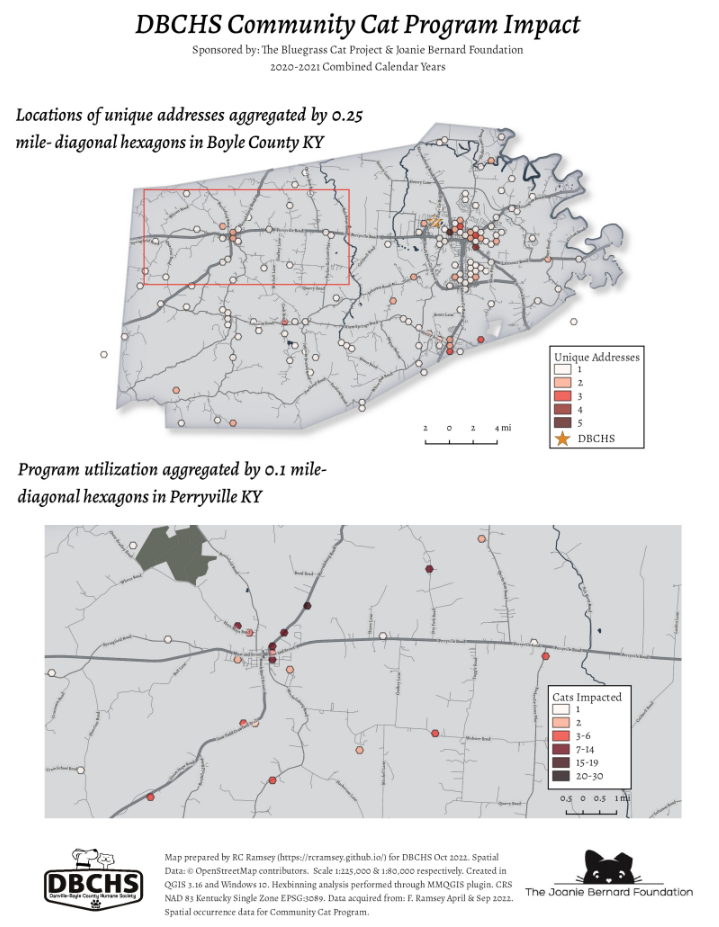

# dbchs_bgadd_communityCats
A volunteer project focused on helping a community visualize the impact of the local Humane Society Community Cat Program

<!-- TOC -->
## Table of Contents
- [Part I. Project Summary Proposal](#part-i-project-summary-proposal)  
- [Part II. Data Sources](#part-ii-data-sources)  
    - [Basemap Data](#basemap-data)
    - [Human Society Data](#humane-society-data)
- [Part III. Proposed Visuals](#part-iii-proposed-visuals)
- [References for readme](#references-for-readme)
- [Final Map](#Final-Map)

<!-- /TOC -->

## Part I: Project Summary Proposal

**Title: DBCHS Community Cat Program Impact**  

This was a passion project from the beginning. A friend of mine was working with their local Humane Society helping implement a [Community Cat Program](https://www.humanesociety.org/resources/community-cat-program) in their area. Most outdoor cats are what The Humane Society of the United States consider *community cats* (friendly strays and feral felines) not suited for indoor life. These same cats are the *most significant source of cat overpopulation in this country* (The Humane Society of The United States). 

Though well meaning, people often collect these community cats and bring them to their local animal shelter. Every year U.S. Animal shelters are brought approximately 3.2 million cats ([ASPCA Pet Statistics](https://www.aspca.org/helping-people-pets/shelter-intake-and-surrender/pet-statistics)). The cost for caring for these cats and attempts at adoption become a heavy burden. Eventually the inability to have these cats adopted, due to their feral nature/fear of people/overwhelming populations, results in the cats being euthanized. Each year approximately 530,000 cats are euthanized across US shelters ([ASPCA Pet Statistics](https://www.aspca.org/helping-people-pets/shelter-intake-and-surrender/pet-statistics)).

The Community Cat program at [DBCHS](https://www.dbchs.org/community-cat) allows the community to schedule a spay/neuter surgery at no cost to the person bringing in the *unowned* community cat. The community cats are then spayed/neutered, vaccinated, and returned to their orginial home location in the community. This is a concept called TNVR (Trap-Neuter-Vaccinate-Return). At DBCHS the community cat program was sponsored by the [Joanie Bernard Foundation](https://www.thejoaniebernardfoundation.org/about-us) and The Bluegrass Cat Project. The Joanie Bernard Foundation has a mission to create a no-kill nation for cats, providing care for strays and feral cat communities while educating the public in the greater Cincinnati Area. 

When I learned from my friend, that their community cats brought in had gps coordinates associated with where they were collected, I asked if they would let me make a map for them as a volunteer project. When numbers and data are presented as facts on spreadsheets, they are useful for creating quick bar charts or graphics but I wanted to give them more power. Maps provide an opportunity for both the folks of the county and organizations at large to see the overall reach and impact that DBCHS was having across the entire county. Not to mention if the program was to continue over multiple years I could already see how the data set would only expand.

It was my hope that the maps created would help stimulate local enthusiasm for the program that was considered a bit progressive and extremely unique for the times. Initially the printouts of the maps were used in small circles for the DBCHS board and eventually were used in presentations with larger organizations. The maps were a visual aid to representing DBCHS' stellar numbers and were key in assisting them in obtaining additional support from national groups. Within two years the DBCHS was receiving endorsements from the Humane Society of the U.S., Bluegrass Cat Project and Team Shelter USA as a *model shelter*. My maps did not make the program the success that it is, DBCHS did that all on their own through their dedicated and tireless efforts to find an alternative to past solutions. I am proud to say what my maps have done is supported their efforts so they could champion themselves to others and show there is indeed an alternative future for keeping happy community cats alive.

## Part II: Data Sources
### Basemap Data
OpenStreetMap: I used QGIS OSM plugin [QuickOSM](https://plugins.qgis.org/plugins/QuickOSM/) to pull roads, buildings, rivers, streams, lakes and green spaces ([OpenStreetMap Contributors](https://www.openstreetmap.org/about/)). This data was used to create the basemap for the project.

### Humane Society Data
Data Provided in a CSV format from DBCHS. Data included: state, zip code, city, gps coordinates/nearest physical address, number of community cats collected from the location brought to participate in the program.  

## Part III. Proposed Visual
Boyle County Kentucky covers approximately 474 sq km and contains 13 different communities. The visual would need to cover both the overall general location of the community cats participating in the program, but also provide basic major road names so community members could orient themselves within the county. 

**Visual 1**: Map of entire county showing general point location of years the location had a cat participate in the program.   
**Visual 2**: Map of entire county using a hex-bin grouping, aggregating together the number of unique addresses close to location of cat pickup within a specified distance. Option to show zoomed in locations.   
**Visual 3**: Map of entire county using a hex-bin grouping, aggregating together the number of cats partcipating within a specififed distance. Option to show zoomed in locations.

## References for readme
[ASPCA Pet Statistics](https://www.aspca.org/helping-people-pets/shelter-intake-and-surrender/pet-statistics) referencing data from [Shelter Animals Count](https://www.shelteranimalscount.org/) data from 2019 and other known and estimated sources.  
[DBCHS](https://www.dbchs.org/community-cat)
[Humane Society Community Cat Program](https://www.humanesociety.org/resources/community-cat-program)
[Humane Society](https://www.humanesociety.org/resources/community-cat-program)
[Joanie Bernard Foundation](https://www.thejoaniebernardfoundation.org/about-us)
## Final Maps

